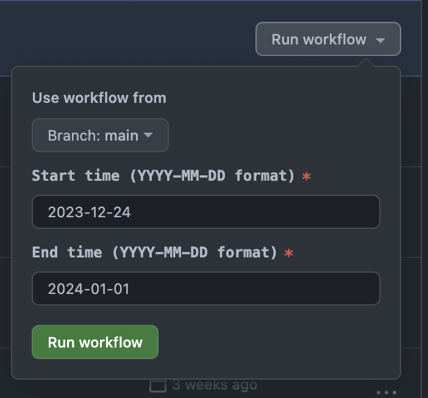
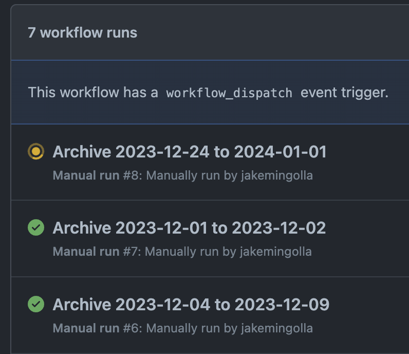
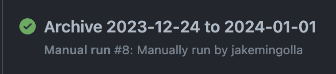
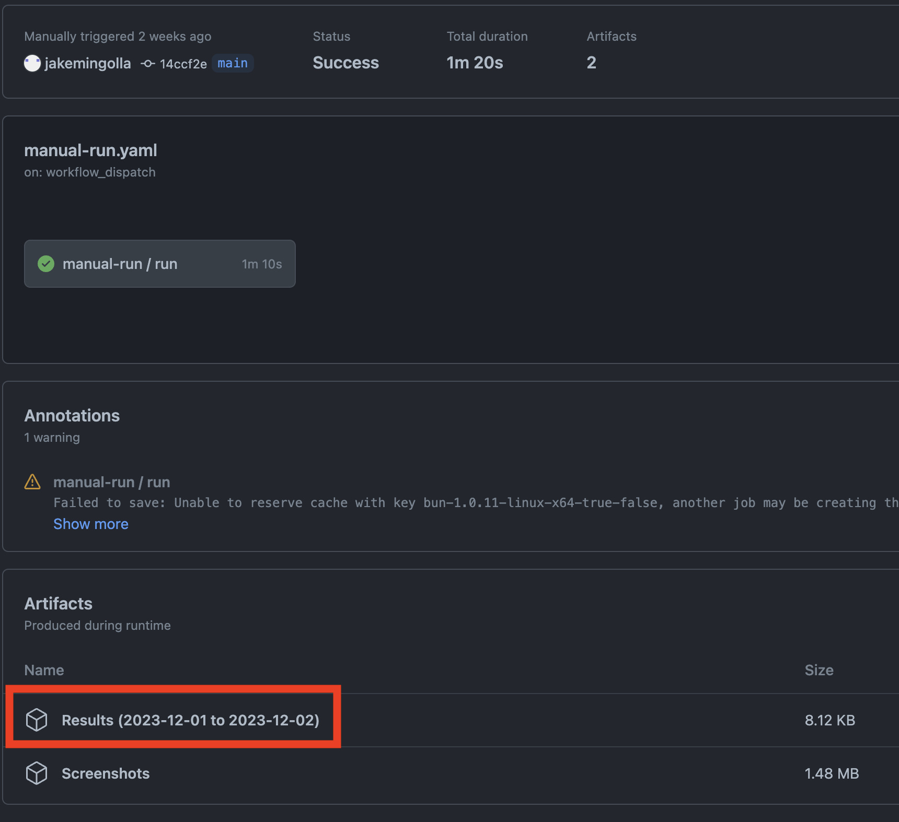

# Manual Archives

This document provides an overview on how to download the `DEEDS` records from
https://www.masslandrecords.com/worcester/ between two dates in CSV format.

## Prerequisites

- You have been added as a collaborator to this repository and can view the
  `Actions` tab
- You can open and view `.csv` files using a program like Microsoft Excel or
  Apple Numbers
- You can decompress `.zip` files using a program like
  [7zip](https://www.7-zip.org/) or a built-in utility

## Instructions

1. Navigate to the [Manual
   run](https://github.com/jakemingolla/worcester-deed-archive/actions/workflows/manual-run.yaml)
   actions page within the GitHub repository.

2. On the right side of your screen, press the `Run workflow` button. Fill in
   the start and end times in `YYYY-MM-DD` format, like `2024-01-10` for January
   10th, 2024.

  

3. Press the green `Run workflow` button.

4. After a few moments, the pending run will appear in the list. It will have an
   yellow spinner while it is in progress.

  

5. Come back in 5 - 10 minutes and the yellow spinner will be replaced by a
   green checkmark. Click the name of the run to view the CSV results:

  

> [!CAUTION]
> If a row has a red font with an X as its logo, contact an administrator of
> this repository.

6. In the `Artifacts` section, click the file starting with `Results`:

  

7. Depending on your browser, the download might compressed as a `.zip` file.
   You may need to decompress it it in order to view the CSV results.

8. Open the resulting `.csv` file in your CSV viewing application
