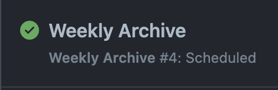
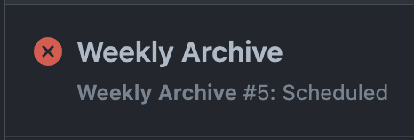
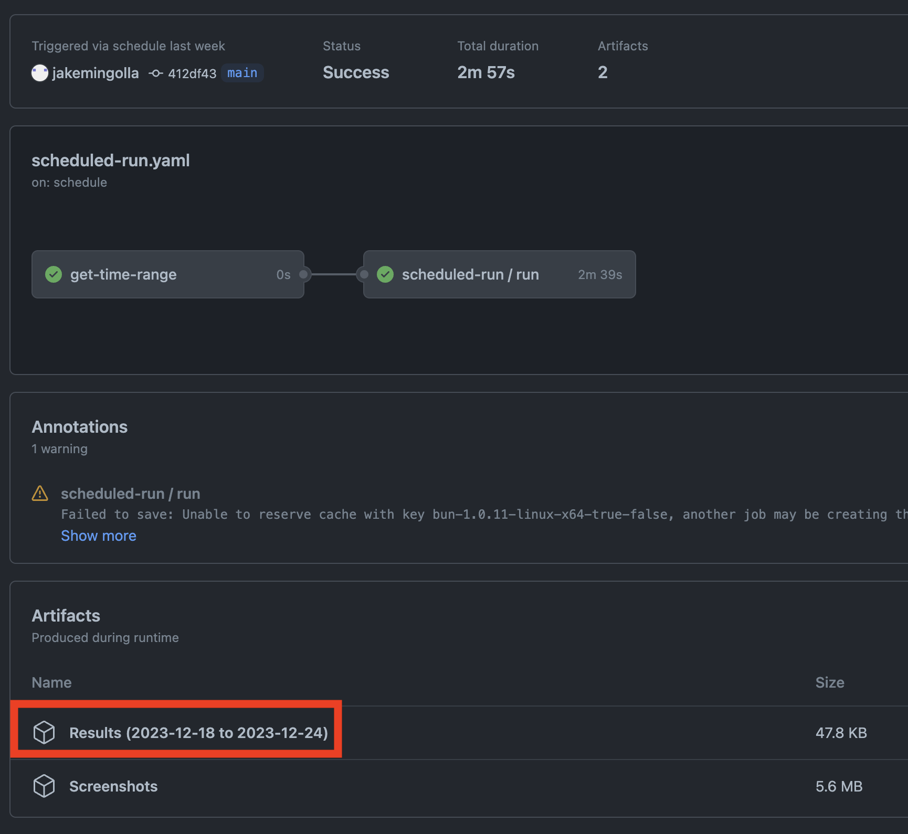

# Weekly Archives

This repository creates weekly archive of
https://www.masslandrecords.com/worcester/, most notably the `DEEDS` for the
past week in CSV format.

This document provides an overview of how to download the most recent weekly
archive in CSV format.

## Prerequisites

- You have been added as a collaborator to this repository and can view the
  `Actions` tab
- You can open and view `.csv` files using a program like Microsoft Excel or
  Apple Numbers
- You can decompress `.zip` files using a program like
  [7zip](https://www.7-zip.org/) or a built-in utility

## Instructions

1. Navigate to the [weekly archive
   page](https://github.com/jakemingolla/worcester-deed-archive/actions/workflows/scheduled-run.yaml).
   Every Monday morning a new scheduled archive is performed and will show up in
   this list. They are sorted in chronologically descending order, so the first row
   in the list will always be the most recent run.

2. Navigate to the most recent row in the list by clicking it:

  

> [!NOTE]
> In a future release, each row's name will correspond to the dates it archives.

> [!CAUTION]
> If a row has a red font with an X as its logo, contact an administrator of
> this repository. There will not be a CSV generated for this week. 3.

  

3. You will see an overview of the job. Clicking the link highlighted below in
   red to begin downloading the CSV archive of the deeds:

  

4. Depending on your browser, the download might compressed as a `.zip` file.
   You may need to decompress it it in order to view the CSV results.

5. Open the resulting `.csv` file in your CSV viewing application
